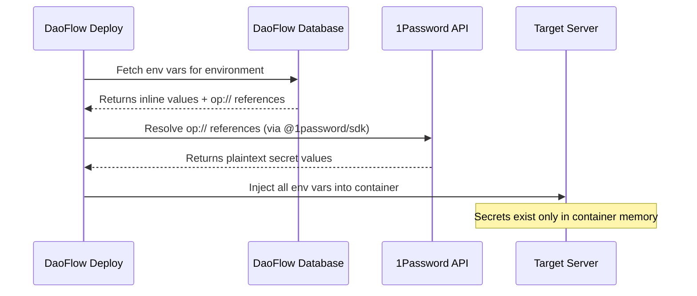

# 1Password Integration

DaoFlow supports [1Password Service Accounts](https://developer.1password.com/docs/service-accounts/) as an external secret provider. Instead of storing secret values directly in DaoFlow, you can reference secrets stored in 1Password vaults using `op://` URIs that are resolved at **deployment time**.

## Why 1Password?

- **Zero secrets in DaoFlow** — only the reference URI (`op://vault/item/field`) is stored
- **Single source of truth** — manage secrets in 1Password, deploy through DaoFlow
- **Automatic rotation** — update the secret in 1Password, next deploy picks it up
- **Audit trail** — both 1Password and DaoFlow track access
- **AI-agent safe** — agents never see plaintext secrets, only `op://` references

## Prerequisites

1. A [1Password Business](https://1password.com/business) or Teams account
2. A [Service Account](https://developer.1password.com/docs/service-accounts/get-started/) with read access to the vault(s) containing your secrets
3. The service account token (starts with `ops_...`)

## Setup

### 1. Add a Secret Provider

#### Via UI

1. Go to **Settings → Secret Providers**
2. Click **Add Provider**
3. Enter a name (e.g. "Production Secrets")
4. Select **1Password** as the type
5. Paste your service account token
6. Click **Create** — DaoFlow encrypts and stores the token

#### Via CLI

```bash
# Not yet implemented — use the UI for now
```

### 2. Set Environment Variables with Secret References

#### Via CLI

```bash
# Set a variable that references a 1Password secret
daoflow env set \
  --env-id env_abc123 \
  --key DATABASE_PASSWORD \
  --secret-ref "op://Production/database/password" \
  --yes

# Set another from a different vault
daoflow env set \
  --env-id env_abc123 \
  --key STRIPE_SECRET_KEY \
  --secret-ref "op://Payments/stripe-api/secret-key" \
  --yes
```

#### Via API

```bash
curl -X POST /trpc/upsertEnvironmentVariable \
  -H "Authorization: Bearer $TOKEN" \
  -d '{
    "environmentId": "env_abc123",
    "key": "DATABASE_PASSWORD",
    "value": "[1password:op://Production/database/password]",
    "isSecret": true,
    "category": "runtime",
    "source": "1password",
    "secretRef": "op://Production/database/password"
  }'
```

### 3. View Secret References

```bash
# List all 1Password references for an environment
daoflow env resolve --env-id env_abc123

# Output:
#   1Password References (2 variables)
#
#   DATABASE_PASSWORD → op://Production/database/password  [resolved at deploy time]
#   STRIPE_SECRET_KEY → op://Payments/stripe-api/secret-key  [resolved at deploy time]
```

## Secret Reference Format

1Password secret references use the `op://` URI format:

```
op://<vault-name>/<item-name>/<field-name>
```

| Component    | Description               | Example      |
| ------------ | ------------------------- | ------------ |
| `vault-name` | The 1Password vault       | `Production` |
| `item-name`  | The item within the vault | `database`   |
| `field-name` | The specific field        | `password`   |

Sections are also supported:

```
op://Production/database/connection/password
```

## How Resolution Works



1. During deployment, DaoFlow fetches all environment variables
2. Variables with `source: "1password"` have their `op://` URIs resolved via the 1Password SDK
3. Resolved plaintext values are injected directly into the container — never stored in DaoFlow
4. If resolution fails, the deployment is halted with a clear error

## Security Model

| Concern       | How DaoFlow Handles It                                           |
| ------------- | ---------------------------------------------------------------- |
| Token storage | Encrypted at rest with AES-256-GCM                               |
| Secret access | Only at deployment time; never persisted in plaintext            |
| Token scope   | Use vault-scoped service accounts (principle of least privilege) |
| Audit         | Both DaoFlow and 1Password record access events                  |
| Agent safety  | Agents see `op://` URIs, never plaintext values                  |

## Troubleshooting

### "No 1Password provider configured"

Add a secret provider in **Settings → Secret Providers** with a valid service account token.

### "Failed to resolve 1Password secret"

- Verify the `op://` URI is correct: `op://vault/item/field`
- Ensure the service account has read access to the specified vault
- Test the connection in **Settings → Secret Providers → Test**

### "Invalid secret reference format"

The URI must match exactly: `op://vault-name/item-name/field-name`. Spaces and special characters in names are allowed but should match what's in 1Password exactly.
